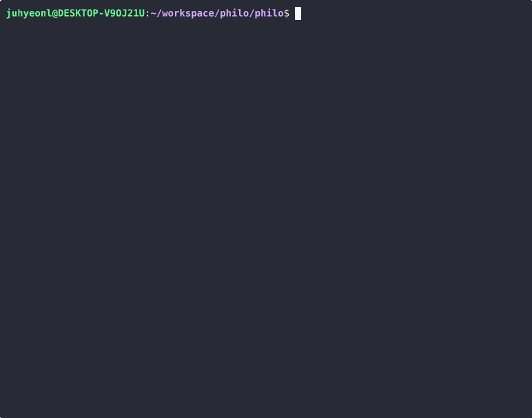

# philosophers


An implementation of the classic **Dining Philosophers Problem** built at [Hive Helsinki](https://www.hive.fi/) (42 Network). Each philosopher is a thread, each fork is a mutex. The goal: everyone eats, nobody dies, no deadlocks.

---

## Demo



*Normal run (5 philosophers) → Death case (4 philosophers, tight timing)*

---

## Architecture

```
              Philosopher 1
             🍽️  [Fork 0]  🍽️
            /                  \
       [Fork 4]                [Fork 1]
          |                       |
  Philosopher 5            Philosopher 2
          |                       |
       [Fork 3]                [Fork 2]
            \                  /
             🍽️  [Fork 2]  🍽️
              Philosopher 3
                    |
              Philosopher 4


    ┌─────────────────────────────────────────┐
    │             Main Thread                 │
    │  ┌─────────┐ ┌─────────┐ ┌─────────┐    │
    │  │ Philo 1 │ │ Philo 2 │ │ Philo N │    │
    │  │ Thread  │ │ Thread  │ │ Thread  │    │
    │  │         │ │         │ │         │    │
    │  │ eat ──► │ │ eat ──► │ │ eat ──► │    │
    │  │ sleep►  │ │ sleep►  │ │ sleep►  │    │
    │  │ think   │ │ think   │ │ think   │    │
    │  └────┬────┘ └────┬────┘ └────┬────┘    │
    │       │           │           │         │
    │       ▼           ▼           ▼         │
    │  ┌──────────────────────────────────┐   │
    │  │     Shared Forks (Mutexes)       │   │
    │  │  [M0]  [M1]  [M2] ... [M(N-1)]   │   │
    │  └──────────────────────────────────┘   │
    │                                         │
    │  ┌──────────────────────────────────┐   │
    │  │   Monitor Thread (Death Check)   │   │
    │  │   Checks each philo's last meal  │   │
    │  │   time_to_die exceeded → stop all│   │
    │  └──────────────────────────────────┘   │
    └─────────────────────────────────────────┘
```

---

## How It Works

### Lifecycle

Each philosopher thread loops through: **eat → sleep → think → repeat**

### Deadlock Prevention

Asymmetric fork pickup order:
- **Even-numbered** philosophers pick up the **right fork first**, then left
- **Odd-numbered** philosophers pick up the **left fork first**, then right

This breaks the circular wait condition and prevents deadlock.

### Death Monitoring

A dedicated monitor thread continuously checks whether any philosopher has exceeded `time_to_die` since their last meal. Once a death is detected, a mutex-protected flag stops all output immediately.

### Timing Precision

`usleep()` can oversleep, so the implementation uses a **busy-wait loop with short sleep intervals** to achieve millisecond-level precision.

---

## Usage

```
./philo number_of_philosophers time_to_die time_to_eat time_to_sleep [meals_required]
```

| Argument | Description |
|---|---|
| `number_of_philosophers` | Number of philosophers (and forks) |
| `time_to_die` | Time (ms) before a philosopher dies without eating |
| `time_to_eat` | Time (ms) it takes to eat |
| `time_to_sleep` | Time (ms) it takes to sleep |
| `meals_required` | *(Optional)* Simulation stops after all philosophers eat this many times |

### Examples

```bash
./philo 5 800 200 200        # 5 philosophers, no one should die
./philo 4 410 200 200        # 4 philosophers, tight but survivable
./philo 4 310 200 100        # 4 philosophers, someone will die
./philo 5 800 200 200 7      # Stop after each philosopher eats 7 times
./philo 1 800 200 200        # Single philosopher — will die (only 1 fork)
```

---

## Build & Run

### Prerequisites

- GCC or Clang
- GNU Make
- POSIX threads (`pthread`)

### Build

```bash
git clone https://github.com/Hyeon-coder/philo.git
cd philo/philo
make
```

### Run

```bash
./philo 5 800 200 200
```

### Clean

```bash
make clean    # Remove object files
make fclean   # Remove object files and binary
make re       # Rebuild from scratch
```

### Verify No Data Races

```bash
# With Helgrind (Valgrind)
valgrind --tool=helgrind ./philo 5 800 200 200

# With ThreadSanitizer (compile with -fsanitize=thread)
```

---

## Key Challenges & What I Learned

### 1. Precise Timing with usleep()
`usleep()` only guarantees a *minimum* sleep duration — the OS may schedule the thread later than requested. To achieve millisecond precision, I implemented a **polling loop** that sleeps in short bursts and checks the actual elapsed time via `gettimeofday()`.

### 2. Deadlock Prevention via Fork Ordering
If all philosophers grab their left fork first, a circular wait deadlock occurs. The solution is **asymmetric ordering**: even philosophers grab right-then-left, odd grab left-then-right. This simple rule eliminates the circular wait condition entirely.

### 3. Accurate Death Detection
The monitor thread must detect death within the `time_to_die` window. If detection is too slow, other threads may print actions after the philosopher has logically died. The solution: **mutex-protect both the output and the death flag** so that status checks and printing are atomic.

### 4. Eliminating Data Races
Every piece of shared state — last meal time, eat count, death flag — must be protected by mutexes. I verified correctness using **Helgrind** and **ThreadSanitizer**, fixing subtle races that only manifested under heavy load.
